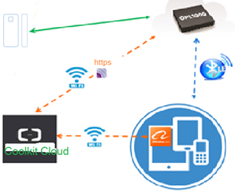

## Function / Feature
- This reference realizes a magnetic door contact device that connects to Coolkit cloud via https. 
- Single chip solution, application runs on OPL1000 M3 MCU.
- Adopt BLE configure WIFI AP to connect Internet / cloud. 
- Smart sleep and auto-connection are support. 
- Power save default setting is "enable smart sleep". 
- Use Coolkit Cloud Intelligent APP to control magnetic door contact device.     

## Work Frame

## Directory and Content 

**prj_src** folder

- Contains reference design source code, include library, implementation c code and project files. 

**Doc** folder

- Contains application guide document. 

**FW_Binary** folder

 - Contains m0 bin file and pack script file that used to generate an integrated firmware.
 - opl1000.bin: OPL1000 integrated firmware file. User can download it to magnetic door contact device and evaluate its function directly. 

## Develop application based on reference

User can develop magnetic door contact type application  (base on https protocol and connect to Coolkit Cloud ) according to this reference design. Generally it includes 3 steps.

1. Register and create product/device on Coolkit cloud, define its property and get  "Coolkit Key 4 elements" parameters for application development. 
2. Modify/extend functions based on existing reference design.
3. Verify message transferring between IOT device, cloud and mobile APP, and validate functions/features.  

